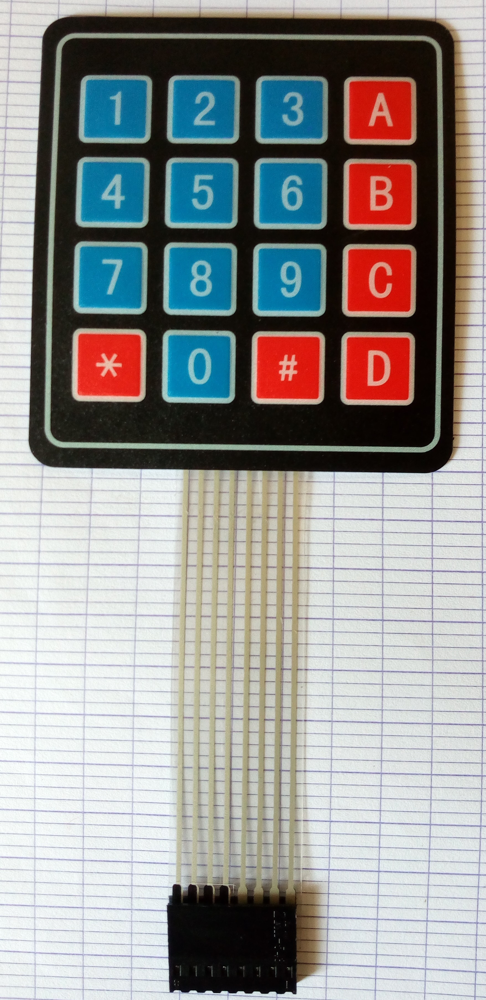

# Keypad ZRX543

This library is build to simplify the usage of the 4x4 ZRX543 keypad. 
It is all based on the Arduino `API` to facilitate integration on many Arduino 
developement project.

## Methods

`char read()`: read a single key from the keypad as a character

`char setDebounceTime(unsigned int time)`: for debouncing purpose, it is used to adjust the 
debouncing time acccording to your requirement. By default, it's value is `300 ms`.

`char readPassword(char start = '*', char end = '#', unsigned int timeout = 15000)`: read a set of character from the keypad and return a string.

`char start`: by default this is set to '*'. It the character configured as the beginning of the stream

`char end`: by default this is set to '#'. It the character configured as the end of the stream

## Default Pinout

Arduino | Keypad
:------:|:------:
2   | 8
3   | 7
4   | 6
5   | 5
6   | 4
7   | 3
8   | 2
9   | 1

## Usages

Instanciation: `Keypad myKeypad;`

Set debounce time: `myKeypad.setDebounceTime(500);`

Read a key: `myKeypad.read();`

Read password with default configuration: `myKeypad.readPassword();`

*Powered by Smart Technology Benin*
